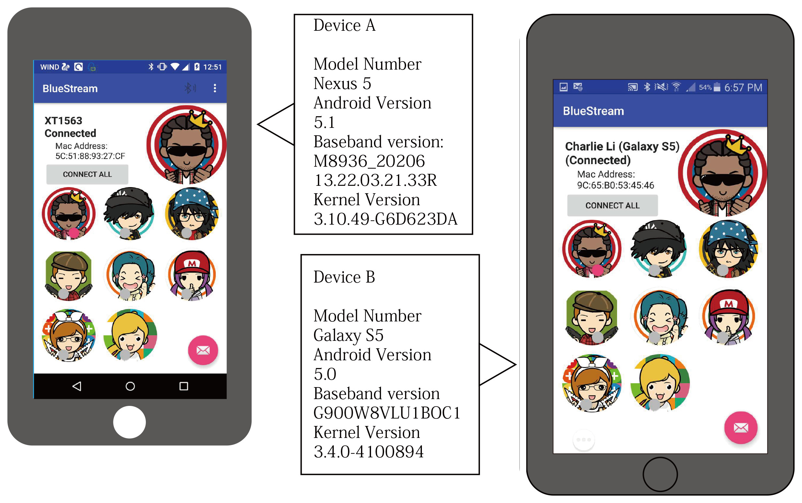
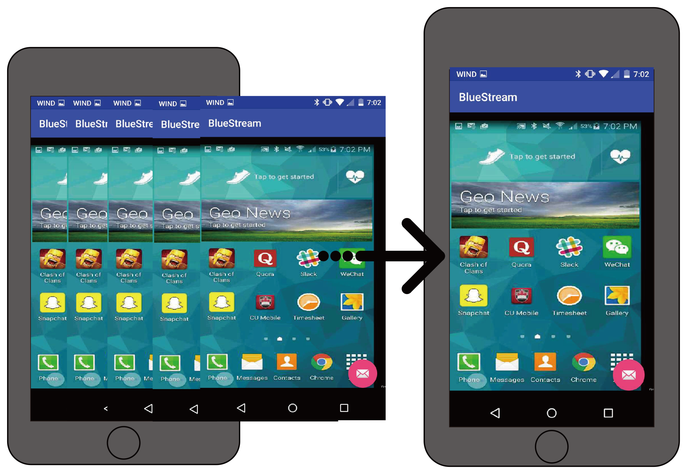

BlueStream Mobile Proxmity Screen Sharing App
====================================================

This application is the latest build for BlueStream, a bluetooth screen sharing android application. 
The application was an experiment to building android apps with the Bluetooth API, MediaProjector API, and MJPEG streaming.

Introduction
------------

This package includes the source code for Android Lollipop or greater to run our app. This application was based on:
- https://github.com/googlesamples/android-BluetoothChat
- https://bitbucket.org/neuralassembly/simplemjpegview

This application uses MJPEG video compression format to facilitate the video stream. 

Pre-requisites
--------------

- Android SDK v21 ( > Lollipop 5.0.x)
- Android Build Tools v23.0.0
- Android Support Repository

Screenshots
-------------

  
